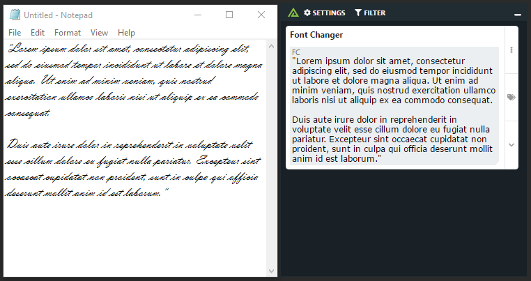

# Polarity Font Changer Integration

The Polarity Font Changer integration is an on-demand integration which converts the selected text into a new font and font-size.  The integration is meant to improve accessibility in cases where fonts are difficult to read.

> This integration can only be run on in on-demand mode on Polarity Server 3.8+ using Polarity Client 3.2+

## Font Changer Integration Options

### Font Family

Display the selected text using the chosen font

### Font Size

Display the selected text using the chosen font size

### Preserve Whitespace

If checked, the integration will preserve the whitespace of the selected text when displaying it in the Overlay Window

## Installation Instructions

Installation instructions for integrations are provided on the [PolarityIO GitHub Page](https://polarityio.github.io/).

## Polarity

Polarity is a memory-augmentation platform that improves and accelerates analyst decision making.  For more information about the Polarity platform please see:

https://polarity.io/
